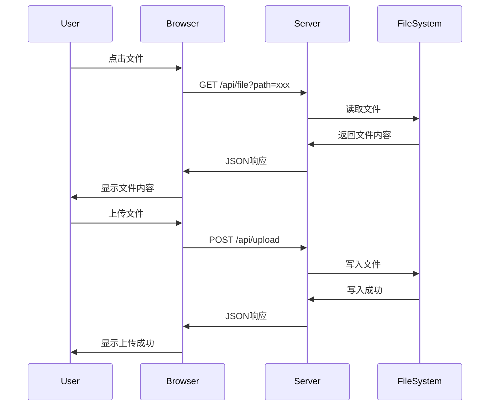

# Raspberry Notes 技术文档

## 1. 项目概述

### 1.1 简介
Raspberry Notes 是一个轻量级的家庭文件管理系统，基于 Python 标准库开发，支持多用户、文件分享、全文搜索、图片预览等功能。特别适合在 Raspberry Pi 等低功耗设备上部署使用。

### 1.2 核心特性
- 📁 **文件管理**: 浏览、上传、下载、删除、重命名
- 🔍 **全文搜索**: 按文件名和文件内容搜索
- 👥 **多用户支持**: Basic Auth 认证
- 📤 **文件分享**: 生成带有效期的分享链接
- 🖼️ **多媒体预览**: 支持图片、PDF、Markdown 预览
- 📊 **日志系统**: 支持日志轮转
- ⚡ **并发处理**: 多线程支持，可同时处理多个请求
- 🔒 **安全防护**: 路径遍历防护、文件类型白名单

### 1.3 技术栈
- **语言**: Python 3.6+
- **框架**: 纯标准库 (http.server, socketserver)
- **前端**: 原生 HTML/CSS/JavaScript
- **依赖**: 无第三方库依赖

### 1.4 系统要求
- Python 3.6 或更高版本
- 内存: 最低 64MB，推荐 256MB+
- 存储: 取决于管理的文件大小
- 支持平台: Linux, macOS, Windows, Raspberry Pi

## 2. 安装与部署

### 2.1 快速开始

```bash
# 1. 下载代码
git clone https://github.com/yourname/raspberry-notes.git
cd raspberry-notes

# 2. 直接启动
python3 server.py

# 3. 访问服务
# 浏览器打开: http://localhost:8000
```

### 2.2 配置方式

系统支持三种配置方式，优先级从高到低：

#### 2.2.1 命令行参数
```bash
python3 server.py -p 8080 -r /home/documents -H 0.0.0.0 -d
```

#### 2.2.2 配置文件 (config.ini)
```ini
[Server]
port = 8000
root_dir = /home/pi/documents
host = 0.0.0.0
max_workers = 10
timeout = 30

[Security]
enable_auth = true
users_file = users.json
session_timeout = 3600
secret_key = your-secret-key-here
allowed_extensions = .md,.txt,.pdf,.jpg,.jpeg,.png
blocked_paths = .git,.env,node_modules
max_file_size = 10485760

[Logging]
log_level = INFO
log_file = server.log
log_max_size = 10485760
log_backup_count = 5

[Features]
enable_upload = true
enable_edit = true
enable_delete = true
enable_rename = true
enable_mkdir = true
enable_share = true
enable_gallery = true
enable_search = true

[Share]
share_expire_hours = 24
share_max_files = 100
share_domain = http://localhost:8000

[Performance]
cache_enabled = true
cache_duration = 300
chunk_size = 8192
preview_image_max_size = 2048
```

#### 2.2.3 默认配置
所有配置项都有合理的默认值，开箱即用。

### 2.3 部署到生产环境

#### 2.3.1 使用 systemd (Linux)
创建服务文件 `/etc/systemd/system/raspberry-notes.service`:

```ini
[Unit]
Description=Raspberry Notes File Manager
After=network.target

[Service]
Type=simple
User=pi
WorkingDirectory=/home/pi/raspberry-notes
ExecStart=/usr/bin/python3 /home/pi/raspberry-notes/server.py -c /home/pi/raspberry-notes/config.ini
Restart=always
RestartSec=10

[Install]
WantedBy=multi-user.target
```

启动服务:
```bash
sudo systemctl daemon-reload
sudo systemctl enable raspberry-notes
sudo systemctl start raspberry-notes
sudo systemctl status raspberry-notes
```

#### 2.3.2 使用 Docker
创建 `Dockerfile`:

```dockerfile
FROM python:3.9-slim

WORKDIR /app
COPY server.py index.html config.ini ./

EXPOSE 8000
CMD ["python3", "server.py"]
```

构建和运行:
```bash
docker build -t raspberry-notes .
docker run -d -p 8000:8000 -v /home/pi/documents:/data raspberry-notes
```

#### 2.3.3 使用 Nginx 反向代理
```nginx
server {
    listen 80;
    server_name notes.example.com;

    location / {
        proxy_pass http://127.0.0.1:8000;
        proxy_set_header Host $host;
        proxy_set_header X-Real-IP $remote_addr;
        proxy_set_header X-Forwarded-For $proxy_add_x_forwarded_for;
        proxy_set_header X-Forwarded-Proto $scheme;
        client_max_body_size 100M;
    }
}
```

## 3. 系统架构

### 3.1 整体架构

```
┌─────────────────────────────────────────────────────────┐
│                   用户浏览器 (前端)                      │
│  ┌─────────────────────────────────────────────────┐   │
│  │  HTML/CSS/JavaScript 单页应用                   │   │
│  │  - 文件列表                                     │   │
│  │  - 文件预览 (Markdown, PDF, 图片)              │   │
│  │  - 文件操作 (上传、删除、重命名、编辑)         │   │
│  │  - 搜索                                        │   │
│  │  - 分享                                        │   │
│  └─────────────────────────────────────────────────┘   │
│                        │                               │
│                        ▼                               │
│  ┌─────────────────────────────────────────────────┐   │
│  │           HTTP/HTTPS (RESTful API)             │   │
│  └─────────────────────────────────────────────────┘   │
│                        │                               │
└────────────────────────┼───────────────────────────────┘
                         │
                         ▼
┌─────────────────────────────────────────────────────────┐
│                  后端服务器 (Python)                     │
│  ┌─────────────────────────────────────────────────┐   │
│  │              多线程 HTTP 服务器                  │   │
│  │  (ThreadingHTTPServer)                         │   │
│  └─────────────────────────────────────────────────┘   │
│                        │                               │
│  ┌─────────────────────────────────────────────────┐   │
│  │              请求处理器                          │   │
│  │  (FileBrowserHandler)                          │   │
│  └─────────────────────────────────────────────────┘   │
│                        │                               │
│  ┌─────────┬─────────┬─────────┬─────────┐           │
│  │ 用户认证 │ 文件操作 │ 分享管理 │ 搜索引擎 │           │
│  │ Manager │  Handler │ Manager │  Engine │           │
│  └─────────┴─────────┴─────────┴─────────┘           │
│                        │                               │
│                        ▼                               │
│  ┌─────────────────────────────────────────────────┐   │
│  │              文件系统 (OS)                       │   │
│  └─────────────────────────────────────────────────┘   │
└─────────────────────────────────────────────────────────┘
```

### 3.2 核心模块

#### 3.2.1 多线程 HTTP 服务器
```python
class ThreadingHTTPServer(ThreadingMixIn, HTTPServer):
    """支持并发请求的多线程HTTP服务器"""
    daemon_threads = True
    allow_reuse_address = True
```

#### 3.2.2 用户认证系统
```python
class UserManager:
    """用户管理和会话管理"""
    - load_users(): 加载用户数据
    - authenticate(): 验证用户
    - create_session(): 创建会话
    - validate_session(): 验证会话
```

#### 3.2.3 文件分享系统
```python
class ShareManager:
    """分享链接管理"""
    - create_share(): 创建分享链接
    - get_share(): 获取分享信息
    - record_download(): 记录下载
    - delete_share(): 删除分享
```

#### 3.2.4 搜索系统
```python
class SearchEngine:
    """文件搜索"""
    - search_files(): 按文件名搜索
    - search_content(): 搜索文件内容
```

### 3.3 数据流



## 4. 性能优化

### 4.1 多线程并发
```python
# 最大并发线程数配置
max_workers = g_config['server'].get('max_workers', 10)
```

### 4.2 大文件分块传输
```python
def _send_large_file(self, file_path, file_name, content_type):
    chunk_size = g_config['performance'].get('chunk_size', 8192)
    with open(file_path, 'rb') as f:
        while True:
            chunk = f.read(chunk_size)
            if not chunk:
                break
            self.wfile.write(chunk)
            self.wfile.flush()
```

### 4.3 缓存机制
```python
# 配置缓存时间
cache_duration = g_config['performance'].get('cache_duration', 300)
```

### 4.4 性能监控
```bash
# 查看线程数
ps -T -p $(pgrep -f "server.py")

# 查看内存使用
top -p $(pgrep -f "server.py")

# 查看网络连接
netstat -an | grep 8000
```

## 5. 安全建议

### 5.1 生产环境部署建议

1. **启用用户认证**
   ```ini
   [Security]
   enable_auth = true
   session_timeout = 3600
   ```

2. **修改默认密码**
   ```bash
   # 编辑 users.json
   {
       "admin": {
           "password": "new_hashed_password",
           "role": "admin"
       }
   }
   ```

3. **限制文件类型**
   ```ini
   allowed_extensions = .md,.txt,.pdf,.jpg,.jpeg,.png,.gif
   ```

4. **限制文件大小**
   ```ini
   max_file_size = 10485760  # 10MB
   ```

5. **使用 HTTPS**
   配置 Nginx 反向代理并启用 SSL。

6. **定期备份**
   ```bash
   # 备份配置和用户数据
   tar -czf backup-$(date +%Y%m%d).tar.gz config.ini users.json shares.json
   ```

### 5.2 安全特性

- ✅ 路径遍历防护
- ✅ 特殊字符过滤
- ✅ 文件类型白名单
- ✅ 文件大小限制
- ✅ 敏感目录屏蔽
- ✅ CORS 安全头
- ✅ XSS 防护
- ✅ 认证机制

## 6. 故障排除

### 6.1 常见问题

#### 端口被占用
```
错误: OSError: [Errno 98] Address already in use
解决: python3 server.py -p 8080
```

#### 权限不足
```
错误: PermissionError: [Errno 13] Permission denied
解决: 检查文件目录权限，确保有读写权限
```

#### 日志文件无法写入
```
错误: 无法创建日志文件: [Errno 13] Permission denied
解决: 检查日志目录权限
```

#### 内存不足
```
症状: 服务响应缓慢或崩溃
解决: 
1. 减少 max_workers
2. 增加系统 swap
3. 升级硬件
```

### 6.2 调试模式
```bash
python3 server.py -d
# 启用调试模式，输出详细日志
```

### 6.3 日志查看
```bash
# 查看实时日志
tail -f server.log

# 查看错误日志
grep ERROR server.log
```

## 7. 维护指南

### 7.1 日志清理
```bash
# 自动清理（日志轮转已自动处理）
# 手动清理
find . -name "server.log.*" -mtime +30 -delete
```

### 7.2 数据备份
```bash
#!/bin/bash
# backup.sh
BACKUP_DIR="/backup/raspberry-notes"
mkdir -p $BACKUP_DIR
cp config.ini $BACKUP_DIR/
cp users.json $BACKUP_DIR/
cp shares.json $BACKUP_DIR/
tar -czf $BACKUP_DIR/files-$(date +%Y%m%d).tar.gz /path/to/documents
```

### 7.3 版本升级
```bash
# 1. 备份当前版本
cp -r raspberry-notes raspberry-notes.bak

# 2. 更新代码
git pull

# 3. 检查配置文件变更
diff config.ini.bak config.ini

# 4. 重启服务
systemctl restart raspberry-notes
```

### 7.4 监控检查
```bash
#!/bin/bash
# health_check.sh
curl -s -o /dev/null -w "%{http_code}" http://localhost:8000/
# 返回 200 表示正常
```

## 8. 许可证

MIT License

Copyright (c) 2026 Raspberry Notes

Permission is hereby granted, free of charge, to any person obtaining a copy
of this software and associated documentation files (the "Software"), to deal
in the Software without restriction, including without limitation the rights
to use, copy, modify, merge, publish, distribute, sublicense, and/or sell
copies of the Software, and to permit persons to whom the Software is
furnished to do so, subject to the following conditions:

The above copyright notice and this permission notice shall be included in all
copies or substantial portions of the Software.

---

# Raspberry Notes API 开发文档

## 1. API 概述

### 1.1 基础信息
- **Base URL**: `http://{host}:{port}`
- **响应格式**: JSON
- **字符编码**: UTF-8
- **认证方式**: Basic Auth (可选)

### 1.2 响应结构

#### 成功响应
```json
{
    "success": true,
    "data": { ... },
    "message": "操作成功"
}
```

#### 错误响应
```json
{
    "error": true,
    "status": 404,
    "message": "文件不存在",
    "timestamp": "2026-06-19T10:30:00.000000"
}
```

### 1.3 HTTP 状态码
| 状态码 | 说明 |
|--------|------|
| 200 | 请求成功 |
| 400 | 请求参数错误 |
| 401 | 需要认证 |
| 403 | 权限不足 |
| 404 | 资源不存在 |
| 413 | 文件过大 |
| 500 | 服务器错误 |

## 2. 认证 API

### 2.1 用户认证
**说明**: 使用 Basic Auth 进行认证

**请求头**:
```
Authorization: Basic base64(username:password)
```

**示例**:
```bash
curl -u admin:admin123 http://localhost:8000/api/list
```

## 3. 文件管理 API

### 3.1 获取文件列表
**Endpoint**: `GET /api/list`

**参数**:
| 参数 | 类型 | 必填 | 说明 |
|------|------|------|------|
| path | string | 否 | 目录路径，默认为根目录 |

**响应示例**:
```json
[
    {
        "name": "document.md",
        "is_dir": false,
        "ctime": 1718784000.0,
        "mtime": 1718784000.0,
        "size": 1024,
        "ext": ".md"
    },
    {
        "name": "photos",
        "is_dir": true,
        "ctime": 1718784000.0,
        "mtime": 1718784000.0,
        "size": 4096,
        "ext": ""
    }
]
```

**示例**:
```bash
curl http://localhost:8000/api/list?path=documents
```

### 3.2 获取文件内容
**Endpoint**: `GET /api/file`

**参数**:
| 参数 | 类型 | 必填 | 说明 |
|------|------|------|------|
| path | string | 是 | 文件路径 |
| cwd | string | 否 | 工作目录 |

**响应示例**:
```json
{
    "content": "文件内容...",
    "encoding": "utf-8",
    "size": 1024,
    "ext": ".txt"
}
```

**示例**:
```bash
curl http://localhost:8000/api/file?path=document.md&cwd=documents
```

### 3.3 文件下载
**Endpoint**: `GET /file/{filename}`

**参数**:
| 参数 | 类型 | 必填 | 说明 |
|------|------|------|------|
| cwd | string | 否 | 工作目录 |

**示例**:
```bash
curl http://localhost:8000/file/document.pdf?cwd=docs
```

### 3.4 上传文件
**Endpoint**: `POST /api/upload`

**Content-Type**: `multipart/form-data`

**参数**:
| 参数 | 类型 | 必填 | 说明 |
|------|------|------|------|
| file | file | 是 | 上传的文件 |
| path | string | 否 | 目标目录 |

**响应示例**:
```json
{
    "success": true,
    "message": "上传成功",
    "filename": "document.pdf"
}
```

**示例**:
```bash
curl -X POST -F "file=@/path/to/file.pdf" -F "path=documents" http://localhost:8000/api/upload
```

### 3.5 删除文件/目录
**Endpoint**: `POST /api/delete`

**参数**:
| 参数 | 类型 | 必填 | 说明 |
|------|------|------|------|
| path | string | 是 | 文件/目录路径 |

**响应示例**:
```json
{
    "success": true,
    "message": "删除成功"
}
```

**示例**:
```bash
curl -X POST http://localhost:8000/api/delete?path=old_file.txt
```

### 3.6 重命名文件/目录
**Endpoint**: `POST /api/rename`

**参数**:
| 参数 | 类型 | 必填 | 说明 |
|------|------|------|------|
| old | string | 是 | 原路径 |
| new | string | 是 | 新路径 |

**响应示例**:
```json
{
    "success": true,
    "message": "重命名成功"
}
```

**示例**:
```bash
curl -X POST http://localhost:8000/api/rename?old=old.txt&new=new.txt
```

### 3.7 创建目录
**Endpoint**: `POST /api/mkdir`

**参数**:
| 参数 | 类型 | 必填 | 说明 |
|------|------|------|------|
| path | string | 是 | 目录路径 |

**响应示例**:
```json
{
    "success": true,
    "message": "目录创建成功"
}
```

**示例**:
```bash
curl -X POST http://localhost:8000/api/mkdir?path=new_folder
```

### 3.8 保存文件
**Endpoint**: `POST /api/save`

**参数**:
| 参数 | 类型 | 必填 | 说明 |
|------|------|------|------|
| path | string | 是 | 文件路径 |

**请求体**:
```json
{
    "content": "文件内容..."
}
```

**响应示例**:
```json
{
    "success": true,
    "message": "保存成功"
}
```

**示例**:
```bash
curl -X POST -H "Content-Type: application/json" -d '{"content":"Hello World"}' http://localhost:8000/api/save?path=test.txt
```

## 4. 搜索 API

### 4.1 搜索文件
**Endpoint**: `GET /api/search`

**参数**:
| 参数 | 类型 | 必填 | 说明 |
|------|------|------|------|
| q | string | 是 | 搜索关键词 |

**响应示例**:
```json
{
    "keyword": "document",
    "total": 5,
    "results": [
        {
            "name": "document1.pdf",
            "path": "documents/document1.pdf",
            "size": 1024000,
            "mtime": 1718784000.0
        }
    ]
}
```

**示例**:
```bash
curl http://localhost:8000/api/search?q=document
```

## 5. 分享 API

### 5.1 创建分享链接
**Endpoint**: `POST /api/share`
**参数**:
| 参数 | 类型 | 必填 | 说明 |
|------|------|------|------|
| path | string | 是 | 文件路径 |
| expire | integer | 否 | 过期时间（小时），默认24 |
| max_downloads | integer | 否 | 最大下载次数 |

**响应示例**:
```json
{
    "token": "abc123def456",
    "url": "http://localhost:8000/share/abc123def456",
    "expire": 24,
    "expire_time": "2026-06-20T10:30:00"
}
```

**示例**:
```bash
curl -X POST http://localhost:8000/api/share?path=document.pdf&expire=48&max_downloads=10
```

### 5.2 获取分享信息
**Endpoint**: `GET /api/share_info`

**参数**:
| 参数 | 类型 | 必填 | 说明 |
|------|------|------|------|
| token | string | 是 | 分享令牌 |

**响应示例**:
```json
{
    "path": "document.pdf",
    "created": "2026-06-19T10:30:00",
    "expire": "2026-06-20T10:30:00",
    "downloads": 3,
    "max_downloads": 10
}
```

**示例**:
```bash
curl http://localhost:8000/api/share_info?token=abc123def456
```

## 6. 错误码参考

| 错误码 | 说明 | 解决方案 |
|--------|------|----------|
| 400 | 请求参数错误 | 检查请求参数 |
| 401 | 需要认证 | 添加 Authorization 头 |
| 403 | 权限不足 | 检查用户权限 |
| 404 | 文件不存在 | 检查文件路径 |
| 413 | 文件过大 | 减小文件大小或调整配置 |
| 500 | 服务器错误 | 查看服务器日志 |

## 7. 前端 JavaScript 示例

### 7.1 获取文件列表
```javascript
async function getFileList(path = '') {
    const url = `/api/list?path=${encodeURIComponent(path)}`;
    const response = await fetch(url);
    if (!response.ok) throw new Error('获取列表失败');
    return await response.json();
}
```

### 7.2 上传文件
```javascript
async function uploadFile(file, path = '') {
    const formData = new FormData();
    formData.append('file', file);
    formData.append('path', path);
    
    const response = await fetch('/api/upload', {
        method: 'POST',
        body: formData
    });
    if (!response.ok) throw new Error('上传失败');
    return await response.json();
}
```

### 7.3 删除文件
```javascript
async function deleteFile(path) {
    const url = `/api/delete?path=${encodeURIComponent(path)}`;
    const response = await fetch(url, { method: 'POST' });
    if (!response.ok) throw new Error('删除失败');
    return await response.json();
}
```

### 7.4 搜索文件
```javascript
async function searchFiles(keyword) {
    const url = `/api/search?q=${encodeURIComponent(keyword)}`;
    const response = await fetch(url);
    if (!response.ok) throw new Error('搜索失败');
    return await response.json();
}
```

### 7.5 创建分享链接
```javascript
async function createShare(path, expire = 24, maxDownloads = 0) {
    const url = `/api/share?path=${encodeURIComponent(path)}&expire=${expire}&max_downloads=${maxDownloads}`;
    const response = await fetch(url, { method: 'POST' });
    if (!response.ok) throw new Error('创建分享失败');
    return await response.json();
}
```

## 8. Python 客户端示例

```python
import requests
import json

class RaspberryNotesClient:
    def __init__(self, base_url, username=None, password=None):
        self.base_url = base_url
        self.auth = (username, password) if username else None
    
    def get_file_list(self, path=''):
        url = f"{self.base_url}/api/list"
        params = {'path': path}
        response = requests.get(url, params=params, auth=self.auth)
        response.raise_for_status()
        return response.json()
    
    def upload_file(self, file_path, target_path=''):
        url = f"{self.base_url}/api/upload"
        files = {'file': open(file_path, 'rb')}
        data = {'path': target_path}
        response = requests.post(url, files=files, data=data, auth=self.auth)
        response.raise_for_status()
        return response.json()
    
    def delete_file(self, path):
        url = f"{self.base_url}/api/delete"
        params = {'path': path}
        response = requests.post(url, params=params, auth=self.auth)
        response.raise_for_status()
        return response.json()
    
    def search(self, keyword):
        url = f"{self.base_url}/api/search"
        params = {'q': keyword}
        response = requests.get(url, params=params, auth=self.auth)
        response.raise_for_status()
        return response.json()
    
    def create_share(self, path, expire=24, max_downloads=0):
        url = f"{self.base_url}/api/share"
        params = {
            'path': path,
            'expire': expire,
            'max_downloads': max_downloads
        }
        response = requests.post(url, params=params, auth=self.auth)
        response.raise_for_status()
        return response.json()

# 使用示例
client = RaspberryNotesClient('http://localhost:8000', 'admin', 'admin123')
files = client.get_file_list('documents')
print(json.dumps(files, indent=2))
```

## 9. WebSocket 支持（未来扩展）

虽然当前版本不支持 WebSocket，但可以考虑在未来的版本中添加实时通知功能：

```javascript
// 未来可能的 WebSocket 通知
const ws = new WebSocket('ws://localhost:8000/ws');
ws.onmessage = function(event) {
    const data = JSON.parse(event.data);
    if (data.type === 'file_uploaded') {
        console.log('新文件上传:', data.filename);
    }
};
```

## 10. API 版本管理

当前版本: v1

API 路径格式: `/api/{version}/...`

未来版本将支持: `/api/v2/...`

## 11. 速率限制

建议在 Nginx 层实现速率限制：
```nginx
limit_req_zone $binary_remote_addr zone=api:10m rate=10r/s;

location /api/ {
    limit_req zone=api burst=20;
    proxy_pass http://127.0.0.1:8000;
}
```

## 12. 变更日志

### v1.0.0 (2026-06-19)
- 初始版本发布
- 支持基本的文件 CRUD 操作
- 支持用户认证
- 支持文件分享
- 支持全文搜索

### 未来计划
- 添加 WebSocket 实时通知
- 支持文件版本控制
- 支持批量操作
- 支持文件夹下载（压缩包）